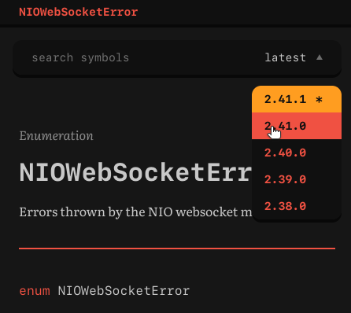

**Swift Biome has been superseded by [Swift Unidoc](https://github.com/tayloraswift/swift-unidoc)!**

  <strong><em><code>biome</code></em></strong> <small><code>0.3.2</code></small>

**`swift-biome`** is a versioned, multi-package Swift documentation compiler. 

Biome is meant to be the back-end component of a web service or a static site generator. Biome handles symbolgraph parsing, dependency resolution, cross-linking, version control, organization, presentation, HTML rendering, and URI routing.

Biome powers the [swiftinit.org ecosystem documentation](https://swiftinit.org/reference/swift)!

## Overview

Biome is built atop many of the same components as DocC. Its primary input source is the symbolgraph format generated by [`lib/SymbolGraphGen`](https://github.com/apple/swift/tree/main/lib/SymbolGraphGen). It also reads `Package.resolved`, and `Package.catalog`, which is generated by the [`swift-package-catalog`](https://github.com/kelvin13/swift-package-catalog) plugin.

Since v0.3.1, Biome compiles raw symbolgraphs ahead-of-time into the `ss` file format, which is a more performant, compact, and compression algorithm-friendly symbolgraph representation. 

Biome includes a tool, `swift-symbolgraphc`, which can be used to convert raw symbolgraphs into `ss` files.

The [`swift-biome-resources`](https://github.com/swift-biome/swift-biome-resources) submodule holds precompiled `ss` files for recent versions of the standard library, and various sources and webpacks for its default frontend.

The [`ecosystem`](https://github.com/swift-biome/ecosystem) repository is not tracked by this repository, but it contains historical symbolgraphs, `Package.resolved` files, and `Package.catalog` files for select ecosystem packages.

The `swift-biome` package includes an executable [`swift-nio`](https://github.com/apple/swift-nio)-based target called `preview` which can be used to build and browse docs locally. **This server does not have security features, and is not intended to be used in production**. 

Consumers of `swift-biome` with more sophisticated use-cases are expected to implement their own web server interfacing with Biome via [`WebSemantics`](https://github.com/kelvin13/swift-resource).

The frontend is written in Sass and Typescript.

## Building  

Building Biome requires the `DEVELOPMENT-SNAPSHOT-2022-08-09-a` toolchain. The toolchain requirement is exact due to the way that [`swift-syntax`](https://github.com/apple/swift-syntax.git) and [`swift-markdown`](https://github.com/apple/swift-markdown.git) link to the swift runtime.

Currently, Biome can only be built on linux. Ubuntu and Amazon Linux 2 are officially supported. The only technical limitations preventing Biome from building on macOS are a handful of file system APIs used by the `PackageLoader` target, and we hope to port Biome to macOS soon.

## Constituents 

### Subpackages 

1. [**`swift-balanced-trees`**](swift-balanced-trees)

    Provides a red-black forest implementation, used by Biome’s in-memory database. (Biome uses a red-black forest, and not a collection of B-trees because it versions symbols individually.)

### Library products 

1. [**`URI`**](Sources/URI)

    Implements a URI parser and basic URI operations.

1. [**`Versions`**](Sources/Versions)

    Implements semantic versions.

1. [**`SymbolGraphs`**](Sources/SymbolGraphs)

    Decodes raw symbolgraph fragments emitted by the swift compiler, performs module-local post-processing, and encodes them into symbolgraph files. Also provides type definitions for various source code constructs. 

1. [**`Biome`**](Sources/Biome)

    Implements the documentation compiler, renderer, and in-memory database. 

1. [**`PackageResolution`**](Sources/PackageResolution)

    Decodes the `Package.resolved` file format. 

1. [**`PackageCatalogs`**](Sources/PackageCatalogs)

    Decodes the `Package.catalog` file format, and handles loading and discovery of symbolgraphs, DocC archives, and SPM snippets from the file system. Can also invoke `SymbolGraphs` to compile raw symbolgraph fragments on-the-fly.

1. [**`PackageLoader`**](Sources/PackageLoader)

    Invokes `PackageCatalogs` and `Biome`, and provides convenience APIs for adding symbolgraphs from the former to the latter.

### Executable products 
        
1. [**`Preview`**](Sources/Preview) (`preview`)

    A basic, unsecured `swift-nio`-based server suitable for browsing Biome docs locally.

2. [**`SymbolGraphConvert`**](Sources/SymbolGraphConvert) (`swift-symbolgraphc`)

    A command-line interface for invoking `SymbolGraphs`. Supports multithreading.

### External dependencies 

1. [**`swift-grammar`**](https://github.com/kelvin13/swift-grammar) 
1. [**`swift-json`**](https://github.com/kelvin13/swift-json) 
1. [**`swift-highlight`**](https://github.com/kelvin13/swift-highlight) 
1. [**`swift-resource`**](https://github.com/kelvin13/swift-resource) 
1. [**`swift-dom`**](https://github.com/kelvin13/swift-dom) 
1. [`apple/`**`swift-markdown`**](https://github.com/apple/swift-markdown)
1. [`apple/`**`swift-syntax`**](https://github.com/apple/swift-syntax)

The swiftinit.org deployment also depends on @Joannis ’s [`mongokitten`](https://github.com/orlandos-nl/MongoKitten), although `swift-biome` itself does not depend on it.
